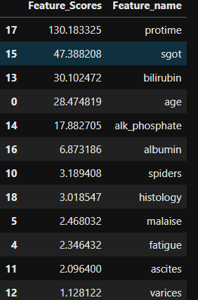
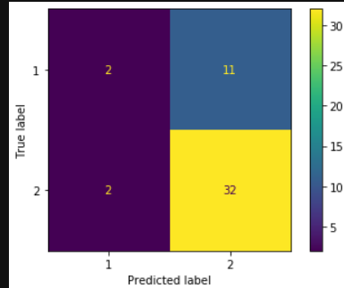
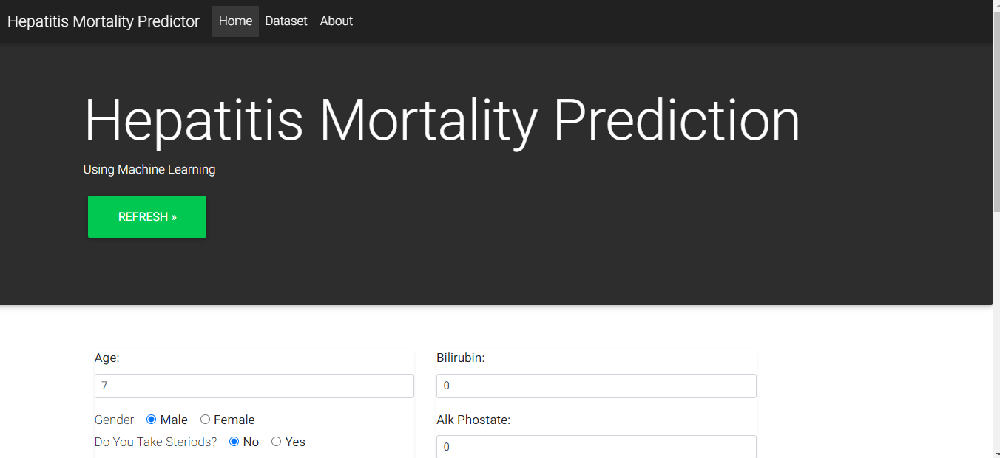
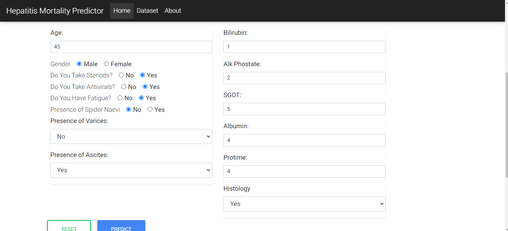
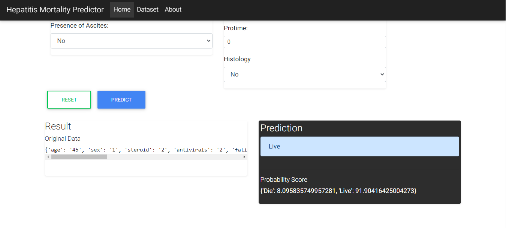

# Hepatitis-Mortality-Predictor

## Goal: 
The Goal of this project is to make a classifier which predict the person will live or die because of hepatitis. It’s a ML app for hepatitis mortality predictor

## introduction: 
This is the Machine Learning Project in which we try to predict the hepatitis mortality using the machine Learning Techniques.

### Technologies Used

+	Python
+	Flask
+	Pandas 
+	Scikit-Learn
+	Numpy
+	HTML, CSS, Javascript, Bootstrap

### WorkFlow

+	Data Preparation
+	EDA
+	Feature Selection
+	Build Model
+	Interpret Model
+	Production with Flask on Localhost

#### Data Preparation:

In this Section, I have cleaned the data, handle the missing values, Perform Scaling etc.

#### Exploratory Data Analysis:

In this Section, We perform the data analysis about the data using some barplot , boxplots etc. In this we also perform the outliers test. 
By Doing Exploratory Data Analysis, we found that:

+	There are more males than females
+	 Highest Prevalence of Hepatitis if from 30-40 followed by 40-50
+	The least is individual under 10 and elderly above 70
+	There are no outliers in the dataset

#### Feature Selection:

In this section, we have perform the feature selection part means we decide that what features we use in our dataset for the model building. We perform feature selection by using SelectKBest, Strong Relation with the target,  Recursive Feature Elimination. 
By performing Feature selection we found that the target is highly dependent on Protime, sgot, bilirubin, age

#### Built Model:

In this section we built the model, By performing the folloeing techniques:
+	Feature & Labels
+	Train/Test/Split
+	Logistic Regression
+	Random Forest Classifier
+	Decision Tree Classifier
By Performing the above techniques, we save our model with Joblib for the deployment of model in the web

#### Interpret the Model:
  We Interpret the model with the techniques like eli5, SHAP,Lime and then evaluate with the model with confusion matrix, classification report etc.

*Confusion Matrix*:-

#### Production with Flask:
	In this section, we made a website and deploy our model on the website.

